<h2>TensorFlow-FlexUNet-Image-Segmentation-Oil-Spill (2025/12/29)</h2>
Toshiyuki Arai 
Software Laboratory antillia.com  
This is the first experiment of Image Segmentation for Oil-Spill 
based on our <a href="./src/TensorFlowFlexUNet.py">TensorFlowFlexUNet</a> (TensorFlow Flexible UNet Image Segmentation Model for Multiclass) , 
and <a href="https://www.kaggle.com/datasets/nabilsherif/oil-spill">
<b>oil spill</b></a> dataset on the kaggle web site.
  

<b>Actual Image Segmentation for Oil-Spill Images of 1250x650 pixels</b> 
As shown below, the inferred masks predicted by our segmentation model trained on the dataset appear similar to the ground truth masks, but they lack precision in certain areas.   
<a href="#color-class-mapping-table">Color class mapping table</a>
 
<table>
<tr>
<th>Input: image</th>
<th>Mask (ground_truth)</th>
<th>Prediction: inferred_mask</th>
</tr>
<tr>
<td></td>
<td></td>
<td>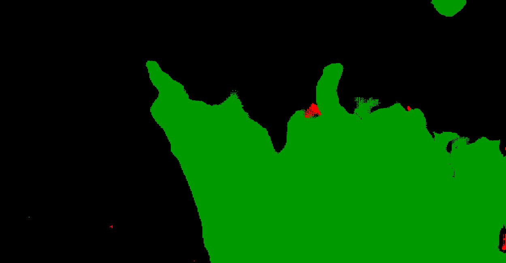</td>
</tr>

<tr>
<td></td>
<td></td>
<td>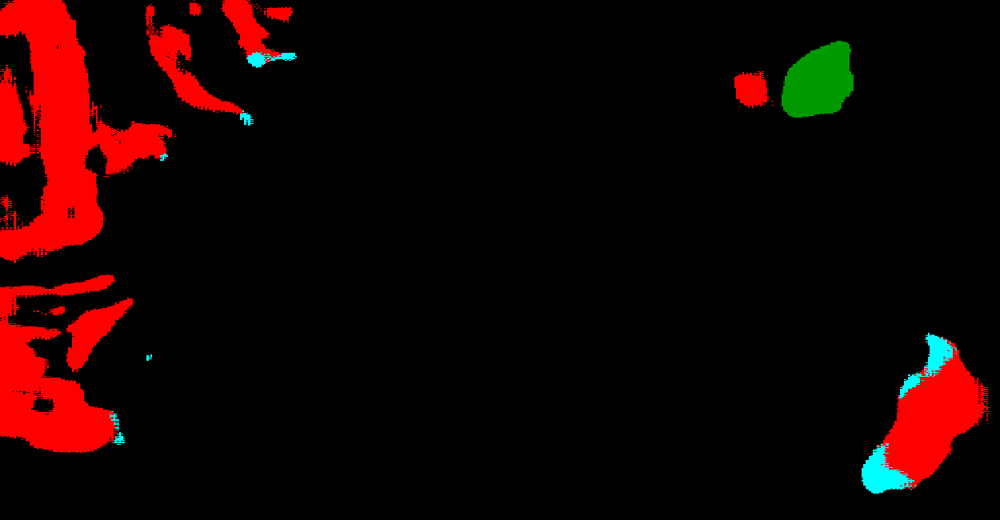</td>
</tr>

<tr>
<td></td>
<td></td>
<td></td>
</tr>

<tr>
<td></td>
<td></td>
<td></td>
</tr>
</table>

 
<h3>1  Dataset Citation</h3>
The dataset used here was derived from the following google drive:  
 <a href="https://www.kaggle.com/datasets/nabilsherif/oil-spill">
<b>oil spill</b></a> dataset on the kaggle web site.
 
It  contains Sentinel-1 SAR imagery annotated for oil spills.  
 
On more information of the dataset, please see also <a href="https://github.com/Harsha0112/Oil-Spill-Detection">Oil-Spill-Detection</a>
  
<b>License</b> 
Unknown
 
 
<h3>
2 Oil-Spill ImageMask Dataset
</h3>
 If you would like to train this Oil-Spill Segmentation model by yourself,
 please download the original dataset from <a href="https://www.kaggle.com/datasets/nabilsherif/oil-spill">
<b>oil spill</b></a>
, expand the downloaded in <b>./dataset </b> folder. and run <a href="./generator/split_master.py">split_master.py</a> to split
the train dataset into train and valid subsets.  
<pre>
./dataset
└─Oil-Spill
    ├─test
    │   ├─images
    │   └─masks
    ├─train
    │   ├─images
    │   └─masks
    └─valid
        ├─images
        └─masks
</pre>
 
<b>Oil-Spill Statistics</b> 
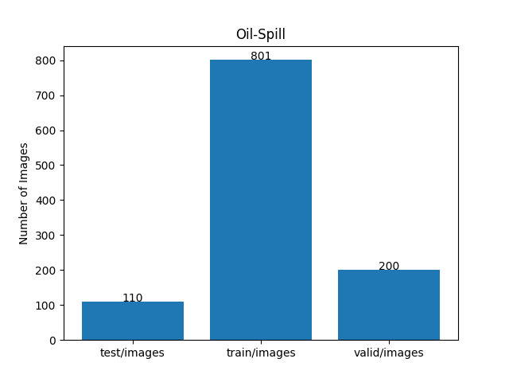 
 
As shown above, the number of images of train and valid datasets is not enough to use for a training set of our segmentation model.
 
We used the following color-class mapping table to define a rgb_map mask format between indexed colors and rgb colors. 
 
<a id="color-class-mapping-table"><b>Oil-Spill color class mapping table</b></a>
<table border=1 style='border-collapse:collapse;' cellpadding='5'>
<tr><th>Indexed Color</th><th>Color</th><th>RGB</th><th>Class</th></tr>
<tr><td>1</td><td with='80' height='auto'></td><td>(0, 255, 255)</td><td>Class1</td></tr>
<tr><td>2</td><td with='80' height='auto'></td><td>(255, 0, 0)</td><td>Class2</td></tr>
<tr><td>3</td><td with='80' height='auto'></td><td>(153, 76, 0)</td><td>Class3</td></tr>
<tr><td>4</td><td with='80' height='auto'></td><td>(0, 153, 0)</td><td>Class4</td></tr>
</table>
 
<b>Train_images_sample</b> 
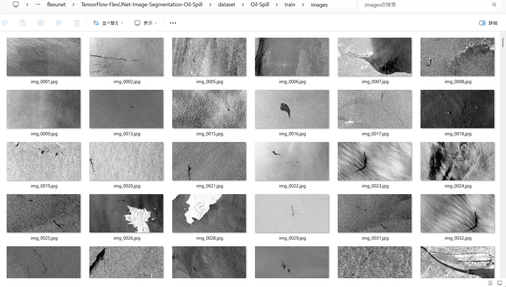
 
<b>Train_masks_sample</b> 
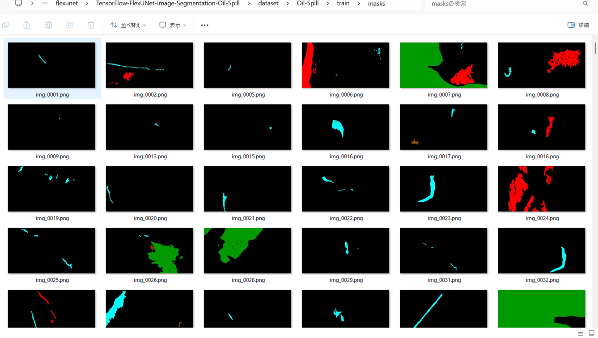
 

<h3>
3 Train TensorflowFlexUNet Model
</h3>
 We trained Oil-Spill TensorflowFlexUNet Model by using the following
<a href="./projects/TensorFlowFlexUNet/Oil-Spill/train_eval_infer.config"> <b>train_eval_infer.config</b></a> file.  
Please move to ./projects/TensorFlowFlexUNet/Oil-Spill and run the following bat file. 
<pre>
>1.train.bat
</pre>
, which simply runs the following command. 
<pre>
>python ../../../src/TensorFlowFlexUNetTrainer.py ./train_eval_infer.config
</pre>

<b>Model parameters</b> 
Defined a small <b>base_filters=16</b> and a large <b>base_kernels=(11,11)</b> for the first Conv Layer of Encoder Block of 
<a href="./src/TensorflowUNet.py">TensorflowUNet.py</a> 
and a large num_layers (including a bridge between Encoder and Decoder Blocks).
<pre>
[model]
image_width    = 512
image_height   = 512
image_channels = 3
input_normalize = True
normalization  = False

num_classes    = 5

base_filters   = 16
base_kernels   = (11,11)
num_layers     = 8

dropout_rate   = 0.04
dilation       = (1,1)
</pre>

<b>Learning rate</b> 
Defined a small learning rate.  
<pre>
[model]
learning_rate  = 0.00005
</pre>

<b>Loss and metrics functions</b> 
Specified "categorical_crossentropy" and "dice_coef_multiclass". 
<pre>
[model]
loss           = "categorical_crossentropy"
metrics        = ["dice_coef_multiclass"]
</pre>
<b >Learning rate reducer callback</b> 
Enabled learing_rate_reducer callback, and a small reducer_patience.
<pre> 
[train]
learning_rate_reducer = True
reducer_factor     = 0.4
reducer_patience   = 4
</pre>
<b>Early stopping callback</b> 
Enabled early stopping callback with patience parameter.
<pre>
[train]
patience      = 10
</pre>
<b></b> 
<b>RGB color map</b> 
rgb color map dict for Oil-Spill 1+11 classes. 
<pre>
[mask]
mask_file_format = ".png"
;Oil-Spill 1+4
rgb_map = {(0,0,0):0, (0,255,255):1, (255,0,0):2, (153,76,0):3, (0,153,0):4}
</pre>
<b>Epoch change inference callbacks</b> 
Enabled epoch_change_infer callback. 
<pre>
[train]
epoch_change_infer       = True
epoch_change_infer_dir   =  "./epoch_change_infer"
epoch_changeinfer        = False
epoch_changeinfer_dir    = "./epoch_changeinfer"
num_infer_images         = 6
</pre>
By using this epoch_change_infer callback, on every epoch_change, the inference procedure can be called
 for 6 images in <b>mini_test</b> folder. This will help you confirm how the predicted mask changes 
 at each epoch during your training process.    
<b>Epoch_change_inference output at starting (1,2,3,4)</b> 
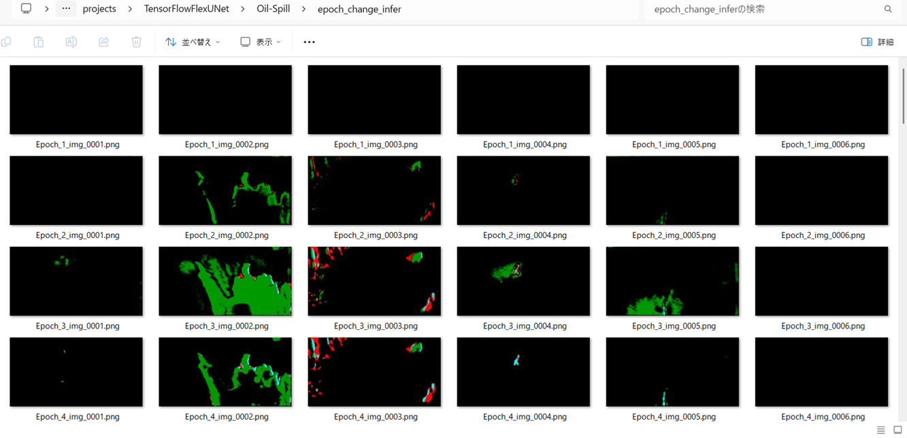 
 
<b>Epoch_change_inference output at ending (37,38,39,40)</b> 
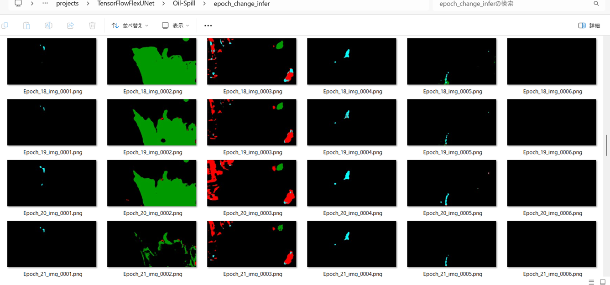 
 
<b>Epoch_change_inference output at ending (74,75,76,77)</b> 
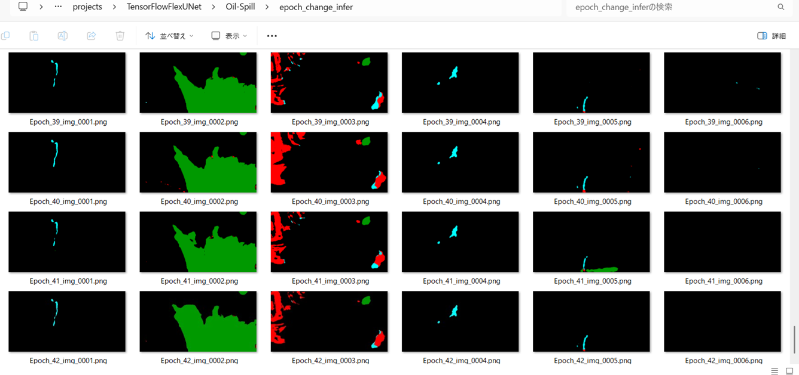 

 
In this experiment, the training process was stopped at epoch 77 by EarlyStoppingCallback.  
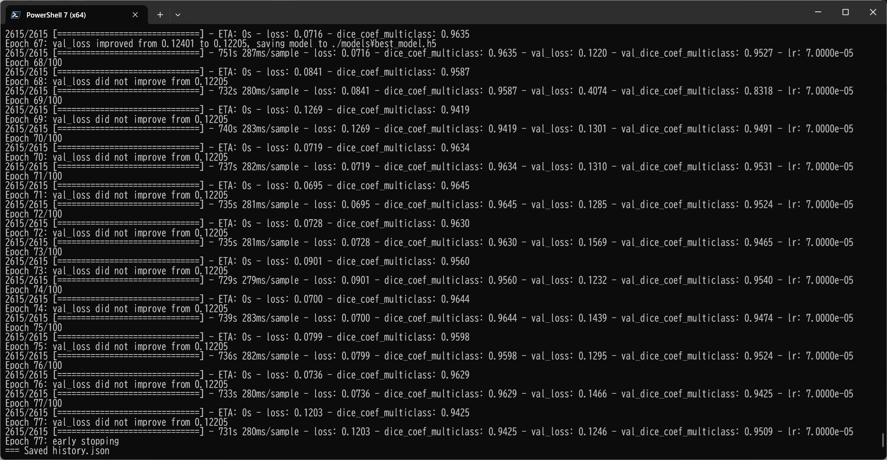 
 
<a href="./projects/TensorFlowFlexUNet/Oil-Spill/eval/train_metrics.csv">train_metrics.csv</a> 
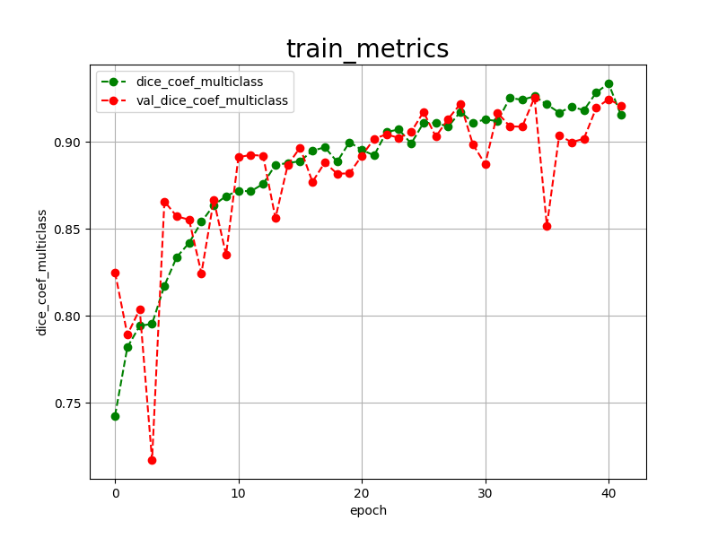 

 
<a href="./projects/TensorFlowFlexUNet/Oil-Spill/eval/train_losses.csv">train_losses.csv</a> 
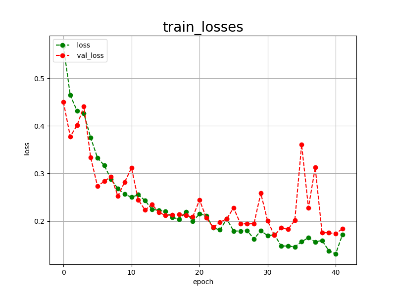 
 

<h3>
4 Evaluation
</h3>
Please move to a <b>./projects/TensorFlowFlexUNet/Oil-Spill</b> folder, 
and run the following bat file to evaluate TensorflowFlexUNet model for Oil-Spill. 
<pre>
>./2.evaluate.bat
</pre>
This bat file simply runs the following command.
<pre>
>python ../../../src/TensorFlowFlexUNetEvaluator.py  ./train_eval_infer.config
</pre>
Evaluation console output: 
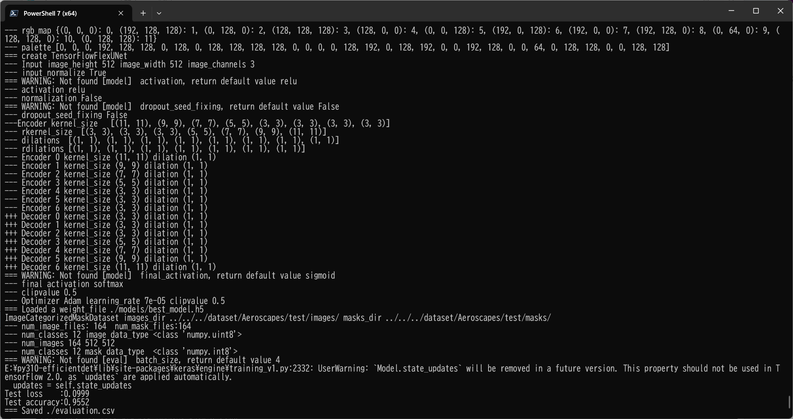
  Image-Segmentation-Oil-Spill

<a href="./projects/TensorFlowFlexUNet/Oil-Spill/evaluation.csv">evaluation.csv</a> 
The loss (categorical_crossentropy) to this Oil-Spill/test was not low, and dice_coef_multiclass  not high as shown below.
 
<pre>
categorical_crossentropy,0.1558
dice_coef_multiclass,0.9192
</pre>
 
<h3>5 Inference</h3>
Please move to a <b>./projects/TensorFlowFlexUNet/Oil-Spill</b> folder 
,and run the following bat file to infer segmentation regions for images by the Trained-TensorflowFlexUNet model for Oil-Spill. 
<pre>
>./3.infer.bat
</pre>
This simply runs the following command.
<pre>
>python ../../../src/TensorFlowFlexUNetInferencer.py ./train_eval_infer.config
</pre>

<b>mini_test_images</b> 
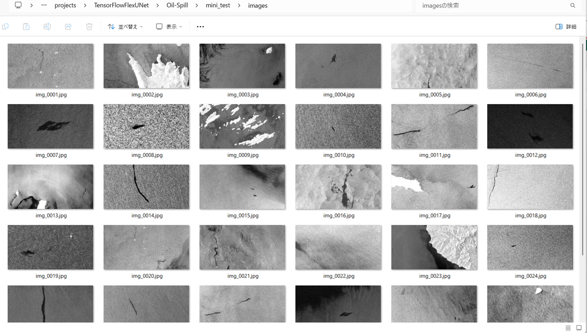 
<b>mini_test_mask(ground_truth)</b> 
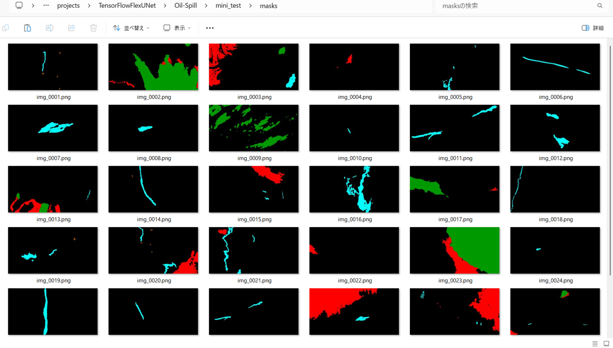 

<b>Inferred test masks</b> 
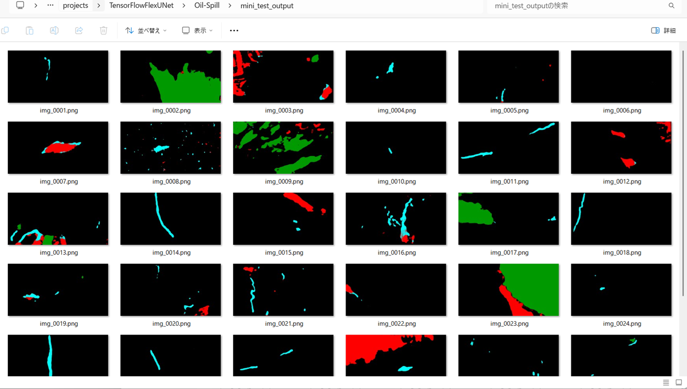 
 

<b>Enlarged images and masks for Oil-Spill Images of 1250x650 pixels</b> 
As shown below, the inferred masks predicted by our segmentation model trained on the dataset appear similar to the ground truth masks, but they lack precision in certain areas.
 
<a href="#color-class-mapping-table">Color class mapping table</a>
 
<table>
<tr>
<th>Input: image</th>
<th>Mask (ground_truth)</th>
<th>Prediction: inferred_mask</th>
</tr>
<tr>
<td></td>
<td></td>
<td></td>
</tr>

<tr>
<td></td>
<td></td>
<td>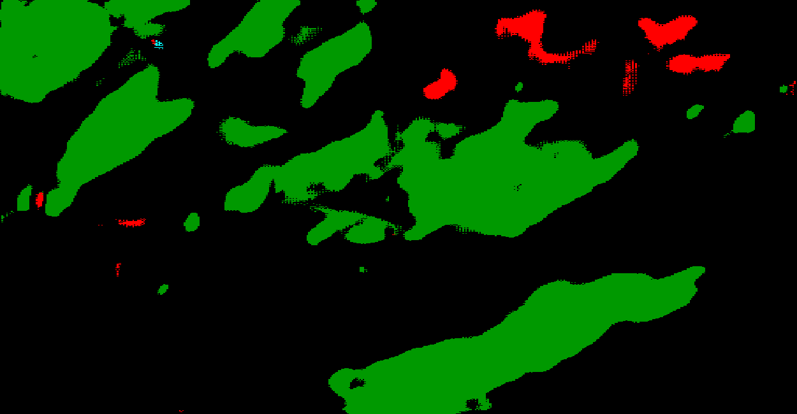</td>
</tr>

<tr>
<td></td>
<td></td>
<td>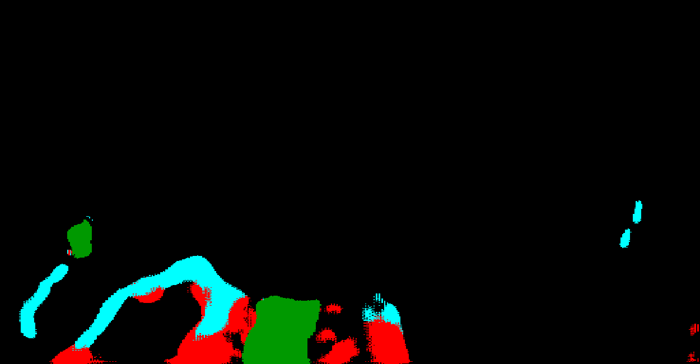</td>
</tr>

<tr>
<td></td>
<td></td>
<td>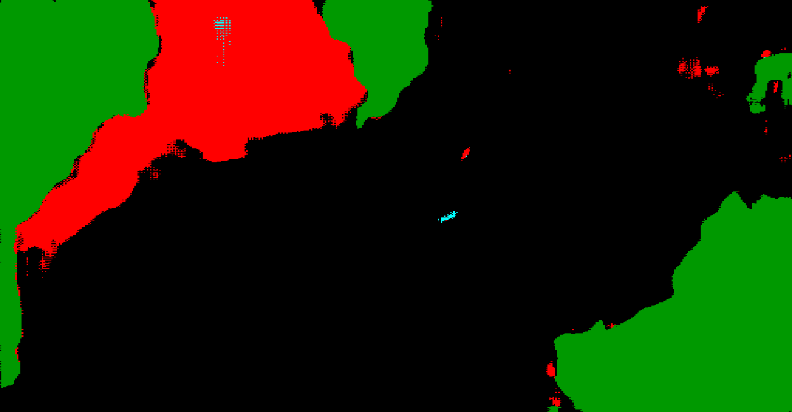</td>
</tr>

<tr>
<td></td>
<td></td>
<td>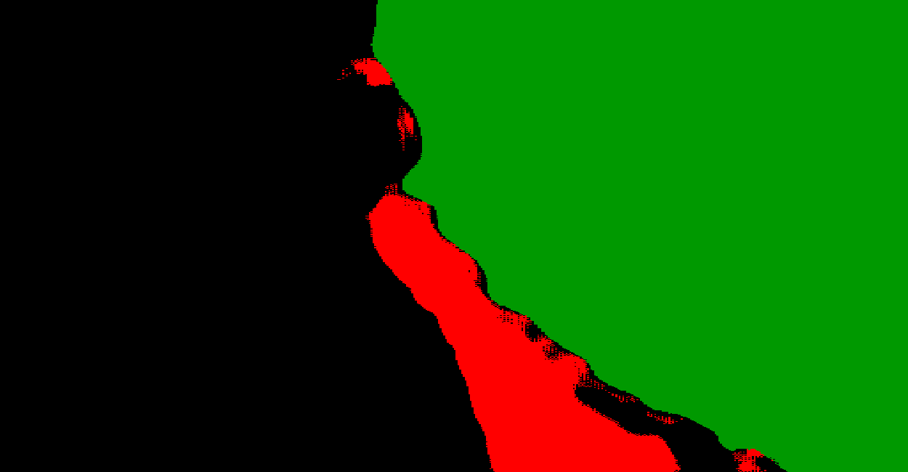</td>
</tr>
<tr>
<td></td>
<td></td>
<td></td>
</tr>

<!-- 
-->
<tr>
<td></td>
<td></td>
<td>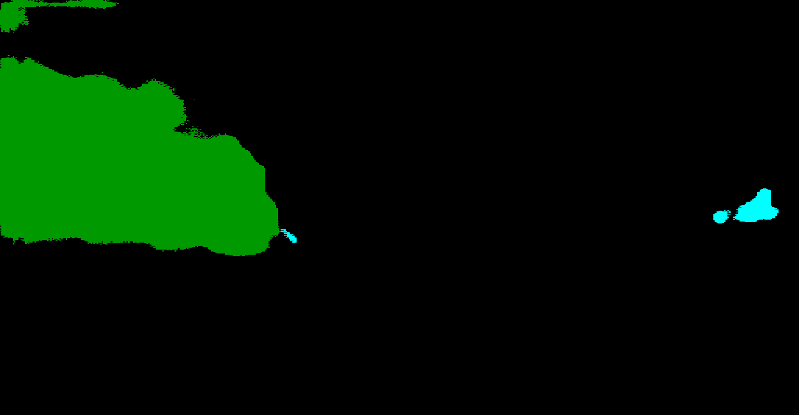</td>
</tr>
<tr>
<td></td>
<td></td>
<td></td>
</tr>

</table>

 
<h3>
References
</h3>
<b>1. Oil Spill Detection using Convolutional Neural Networks and Sentinel-1 SAR Imagery</b> 
Eleftheria Kalogirou, Konstantinos Christofi, Despoina Makri, Muhammad Amjad Iqbal, Valeria La Pegna, 
Marios Tzouvaras, Christodoulos Mettas, Diofantos Hadjimitsis 
<a href="https://isprs-archives.copernicus.org/articles/XLVIII-G-2025/757/2025/isprs-archives-XLVIII-G-2025-757-2025.pdf">
https://isprs-archives.copernicus.org/articles/XLVIII-G-2025/757/2025/isprs-archives-XLVIII-G-2025-757-2025.pdf</a>
 
 
<b>2. Oil spill detection and classification through deep learning and tailored data augmentation</b> 
Ngoc An Bui,  Youngon Oh,  Impyeong Lee 
<a href="https://www.sciencedirect.com/science/article/pii/S1569843224001997">https://www.sciencedirect.com/science/article/pii/S1569843224001997</a>
 
 
<b>3. Oil spill detection by imaging radars: Challenges and pitfalls</b> 
Werner Alpers , Benjamin Holt, Kan Zeng  
<a href="https://www.sciencedirect.com/science/article/pii/S0034425717304145">https://www.sciencedirect.com/science/article/pii/S0034425717304145</a>
 
 
<b>4.  Oil-Spill-Detection</b> 
Harsha0112 
<a href="https://github.com/Harsha0112/Oil-Spill-Detection">https://github.com/Harsha0112/Oil-Spill-Detection</a>
 
 
<b>5. TensorFlow-FlexUNet-Image-Segmentation-Model</b> 
Toshiyuki Arai  
<a href="https://github.com/sarah-antillia/TensorFlow-FlexUNet-Image-Segmentation-Model">
https://github.com/sarah-antillia/TensorFlow-FlexUNet-Image-Segmentation-Model
</a>
 
 
